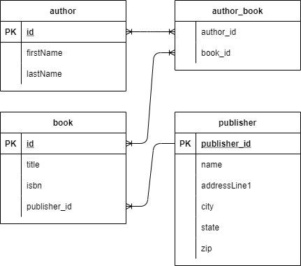

# Simple Spring 5 Web App

A spring web application using spring web and data jpa to create a simple entity model backed by simple CRUD operations.  Created by following along with Spring Framework 5: Beginner to Guru Udemy course.

# Model

A simple many to many relationship between `Author` and `Book` tables;

# Entities

- [Author](src\main\java\com\clarsen\sandbox\udemy\spring\spring5webapp\domain\Author.java)  
- [Book](src\main\java\com\clarsen\sandbox\udemy\spring\spring5webapp\domain\Book.java)  